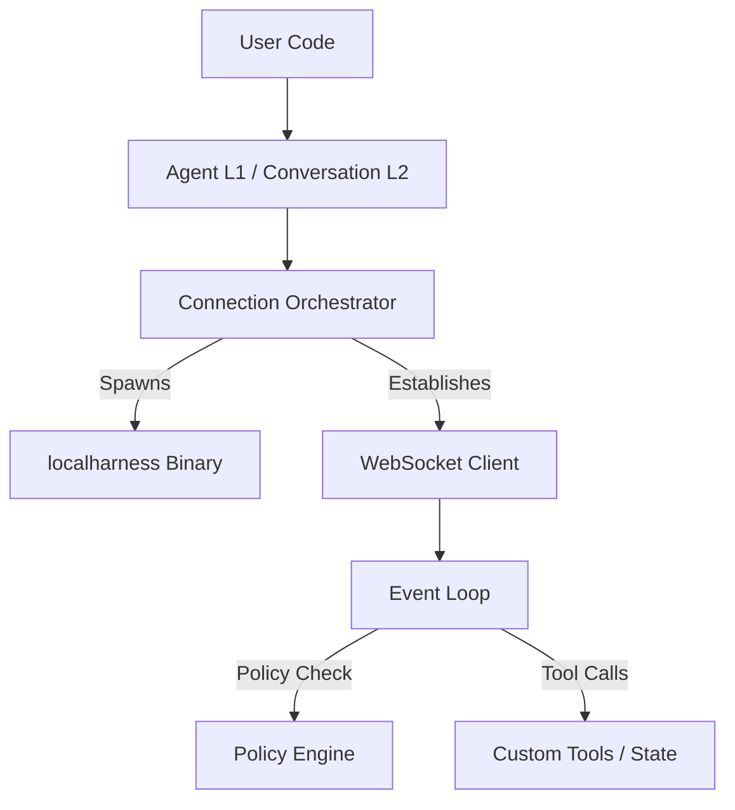

# Antigravity Rust SDK (Unofficial Port)

An async-first, idiomatic Rust port of the **Google Antigravity Python SDK**. This library allows you to build, run, and orchestrate advanced AI agents in Rust, providing seamless integration with the Go-based `localharness` execution engine.

> [!IMPORTANT]
> **Disclaimer**: This is an **unofficial** community port of the Google Antigravity Python SDK. It mirrors the exact capabilities, protocols, and safety mechanisms of the official Python SDK but is completely self-contained in native Rust.

---

## Key Features

* **Zero-Dependency Protobuf Handshake**: Custom, ultra-lightweight varint-based serialization/deserialization. **No system-wide `protoc` compiler required** to build or run.
* **Process Lifecycle Orchestration**: Automatically discovers, spawns, and maintains the Go-based `localharness` execution process from virtual environments or environment overrides.
* **WebSocket Integration**: Fully asynchronous client communication powered by Tokio and Tungstenite.
* **Safety Policies**: Comprehensive local execution boundary guards, including directory-containment filters (`workspace_only`) and command-execution prompts (`confirm_run_command`).
* **Custom & Stateful Tools**: Easily register stateless or stateful custom tools using a shared, thread-safe asynchronous `ToolContext` map.

---

## Architecture Overview



The Rust SDK manages connection strategies, custom tool execution, and local safety validation, while the `localharness` subprocess executes the main agentic loop, calls the Gemini LLM backend, and acts as the capability sandbox.

---

## Prerequisites

The SDK relies on the Go-based `localharness` binary, which is packaged as part of the official Python SDK distribution.

1. **Python Virtual Environment**:
   Initialize a virtual environment in your workspace and install `google-antigravity`:
   ```bash
   uv venv
   uv pip install google-antigravity
   ```

2. **Gemini API Key**:
   Obtain an API key from Google AI Studio and configure it in your environment:
   ```bash
   export GEMINI_API_KEY="your-api-key-here"
   ```

---

## Installation

Add `antigravity-sdk` to your `Cargo.toml`:
```toml
[dependencies]
antigravity-sdk = { path = "../antigravity-sdk" }
tokio = { version = "1.0", features = ["full"] }
futures-util = "0.3"
serde_json = "1.0"
```

---

## Concepts & Quickstarts

### 1. Simple Agent
The `Agent` class is the easiest way to get started. It manages the full lifecycle — binary discovery, tool wiring, hook registration, and policy defaults.

```rust
use antigravity_sdk::{Agent, LocalConnectionStrategy, IntoContent};

#[tokio::main]
async fn main() -> Result<(), Box<dyn std::error::Error>> {
    let mut config = LocalConnectionStrategy::default();
    config.system_instructions = Some(antigravity_sdk::types::SystemInstructions {
        custom: Some(antigravity_sdk::types::CustomSystemInstructions {
            part: vec![antigravity_sdk::types::CustomSystemInstructionPart {
                text: "You are an expert assistant for codebase navigation.".to_string(),
            }],
        }),
        appended: None,
    });

    // Start the agent context (spawns localharness & connects WS)
    let agent = Agent::start(config).await?;

    let response = agent.chat(Some("What files are in the current directory?".into_content())).await?;
    println!("{}", response.text().await);

    agent.stop().await;
    Ok(())
}
```

---

### 2. Streaming Responses
To stream agent output in real-time (e.g., for fluid console applications), obtain a `chunks()` stream from the `ChatResponse`. Use `StreamExt` to yield text chunks as they arrive:

```rust
use antigravity_sdk::{Agent, LocalConnectionStrategy, IntoContent, types::StreamChunk};
use futures_util::StreamExt;
use std::io::Write;

#[tokio::main]
async fn main() -> Result<(), Box<dyn std::error::Error>> {
    let config = LocalConnectionStrategy::default();
    let agent = Agent::start(config).await?;

    // Returns instantly — does not block
    let response = agent.chat(Some("Write a short poem about space.".into_content())).await?;
    
    let mut stream = response.chunks();
    while let Some(chunk) = stream.next().await {
        if let StreamChunk::Text { text, .. } = chunk {
            print!("{}", text);
            std::io::stdout().flush().unwrap();
        }
    }
    println!();

    agent.stop().await;
    Ok(())
}
```

---

### 3. Intercepting Thoughts & Tool Calls (Advanced Streaming)
For more complex use cases, you can stream internal model reasoning (thinking chain) or intercept tool calls as they dispatch:

```rust
use futures_util::StreamExt;
use antigravity_sdk::types::StreamChunk;

let mut stream = response.chunks();
while let Some(chunk) = stream.next().await {
    match chunk {
        StreamChunk::Thought { text, .. } => {
            // Real-time reasoning/thinking deltas
            show_thinking_bubble(&text);
        }
        StreamChunk::Text { text, .. } => {
            // Conversational text output
            print!("{}", text);
        }
        StreamChunk::ToolCall(call) => {
            // Strongly-typed tool invocation event
            show_executing_spinner(&call.name);
        }
    }
}
```

---

### 4. Advanced Usage with `Conversation`
For fine-grained control over the session history, token counts, and lower-level step streaming, interact with `Conversation` directly:

```rust
use antigravity_sdk::{LocalConnectionStrategy, Conversation, IntoContent};
use futures_util::StreamExt;
use std::sync::Arc;

#[tokio::main]
async fn main() -> Result<(), Box<dyn std::error::Error>> {
    let strategy = LocalConnectionStrategy::default();
    let connection = strategy.connect().await?;
    
    let conversation = Conversation::new(connection);

    // 1. High-level send + wait for response
    let response = conversation.chat(Some("What files are here?".into_content())).await?;
    println!("{}", response.text().await);

    // 2. Access step and turn history introspection
    println!("Total steps: {}", conversation.history().await.len());
    println!("Turns: {}", conversation.turn_count().await);
    println!("Last response: {}", conversation.last_response().await);

    // 3. Low-level step streaming
    conversation.send(Some("Tell me more.".into_content())).await?;
    let mut step_stream = conversation.receive_steps();
    while let Some(step) = step_stream.next().await {
        if step.status == antigravity_sdk::types::StepStatus::Done {
            println!("Step content: {}", step.content);
        }
    }

    conversation.disconnect().await;
    Ok(())
}
```

---

### 5. Multimodal Ingestion
Pass images, PDFs, audio, or custom raw binary data to the agent alongside instructions using `ContentPrimitive` items:

```rust
use antigravity_sdk::{Agent, LocalConnectionStrategy};
use antigravity_sdk::types::{ContentPrimitive, MediaInput};

#[tokio::main]
async fn main() -> Result<(), Box<dyn std::error::Error>> {
    let config = LocalConnectionStrategy::default();
    let agent = Agent::start(config).await?;

    // 1. Load spec file (document format)
    let pdf_spec = ContentPrimitive::Media(MediaInput {
        mime_type: "application/pdf".to_string(),
        data: std::fs::read("spec.pdf")?,
        description: Some("System Specification Document".to_string()),
    });

    // 2. Raw PNG image bytes constructor
    let chart_image = ContentPrimitive::Media(MediaInput {
        mime_type: "image/png".to_string(),
        data: vec![/* raw png bytes */],
        description: Some("Architecture blueprint".to_string()),
    });

    // Send the mixed multimodal prompt
    let prompt = vec![
        ContentPrimitive::Text("Analyze this chart against the specification and list three security vulnerabilities:".to_string()),
        chart_image,
        pdf_spec,
    ];

    let response = agent.chat(Some(prompt)).await?;
    println!("{}", response.text().await);

    agent.stop().await;
    Ok(())
}
```

---

### 6. Custom Tools
Implement the `CustomTool` trait to register local Rust functions and stateful logic:

```rust
use antigravity_sdk::{Agent, LocalConnectionStrategy, CustomTool, ToolContext, ToolFuture};
use serde_json::{json, Value};
use std::sync::Arc;

struct GetWeather;

impl CustomTool for GetWeather {
    fn name(&self) -> &str {
        "get_weather"
    }

    fn description(&self) -> &str {
        "Returns the current weather for a city."
    }

    fn parameters_schema(&self) -> Value {
        json!({
            "type": "object",
            "properties": {
                "city": { "type": "string" }
            },
            "required": ["city"]
        })
    }

    fn call(&self, args: Value, _ctx: Option<ToolContext>) -> ToolFuture {
        Box::pin(async move {
            let city = args.get("city").and_then(|v| v.as_str()).unwrap_or("Tokyo");
            Ok(json!(format!("It's sunny in {}.", city)))
        })
    }
}

#[tokio::main]
async fn main() -> Result<(), Box<dyn std::error::Error>> {
    let mut config = LocalConnectionStrategy::default();
    config.custom_tools.push(Arc::new(GetWeather));

    let agent = Agent::start(config).await?;
    let response = agent.chat(Some("What's the weather in Tokyo?".into_content())).await?;
    println!("{}", response.text().await);

    agent.stop().await;
    Ok(())
}
```

---

### 7. Hooks & Safety Policies
Apply a granular safety permission engine to intercept and control agent actions locally:

```rust
use antigravity_sdk::{
    Agent, LocalConnectionStrategy,
    deny_all, allow, ask_user,
    types::CapabilitiesConfig
};

// Custom human-in-the-loop approval callback
let confirm_shell_policy = ask_user("run_command", |tool_call| {
    println!("Agent wants to run: {:?}", tool_call.args);
    print!("Approve? (y/n): ");
    std::io::Write::flush(&mut std::io::stdout()).unwrap();
    
    let mut input = String::new();
    std::io::stdin().read_line(&mut input).unwrap();
    input.trim().to_lowercase() == "y"
});

let mut config = LocalConnectionStrategy::default();
config.capabilities = CapabilitiesConfig::default(); // Enables write actions

config.policies = vec![
    deny_all(),                  // Deny all tool calls by default
    allow("view_file"),          // Safely allow viewing files
    confirm_shell_policy,        // Hook user input for shell runs
];
```

---

## Running the Examples

Execute the packaged integration scripts to check communication in your terminal:

### Chat Example
```bash
cargo run --example hello_world
```

### Custom & Stateful Tools Example
```bash
cargo run --example custom_tools
```
