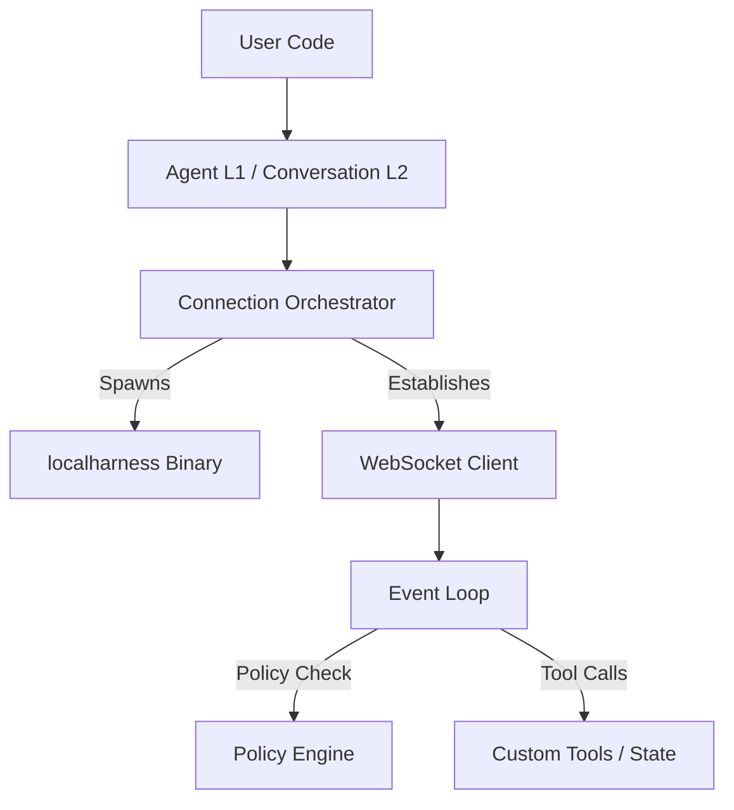

# Localharness Architecture & Orchestration

The Go-based **`localharness`** binary serves as the **core local execution engine and orchestrator** for the Google Antigravity agentic framework. 

Rather than having language-specific SDKs (Rust, Python) implement the complex state machines, LLM communication, sandboxing, and event loops themselves, the SDKs act as lightweight API frontends, while `localharness` manages the heavy lifting.

---

## Technical Overview & Lifecycle

### 1. Process Host & Connection Gateway
* **Initialization**: When an agent session starts, the SDK spawns the `localharness` subprocess. The SDK pipes in `InputConfig` (specifying details like the storage/workspace directory) via standard input using a lightweight binary Protobuf payload.
* **WebSocket Server**: The harness dynamically boots a local WebSocket server on an ephemeral port, establishes a secure session token (API key), and pipes this setup back to the SDK using Protobuf `OutputConfig` over standard output.
* **Event Transport**: It hosts the WebSocket connection through which all subsequent conversation inputs, trajectory updates, tool calls, and model outputs flow in real time.

### 2. The LLM Agent Execution Loop (The "Brain")
* **LLM Client Orchestration**: `localharness` communicates directly with the Google Gemini API (or other configured backends) using the user's `GEMINI_API_KEY`.
* **Prompt Engineering & System Instructions**: It aggregates system instructions, persona configs, and context windows, packaging them correctly for the LLM.
* **Agent Loop Control**: It implements the cognitive loop: receiving a prompt, obtaining raw thinking and text from the model, invoking tools, and feeding results back to the model.

### 3. Trajectory & Step State Machine
* It maintains the formal **State Machine** of the agent's trajectory.
* It breaks down complex multi-step actions into discrete **Steps** and streams updates (`StepUpdate` events) to the SDK:
  - **Source/Target**: Tracks who initiated the step (`System`, `User`, `Model`) and what it targets.
  - **Deltas**: Streams fine-grained `thinking_delta` (model reasoning) and `text_delta` (model response) to allow smooth real-time token streaming.
  - **Step States**: Publishes transitioning states (`Active`, `Done`, `WaitingForUser`, `Error`).

### 4. Local Capability Sandbox & Tool Executor
* **Built-in File/System Tools**: It contains the local implementations of file manipulation, directory listing, searching, and shell execution.
* **Browser/Sandboxed Execution**: It orchestrates GUI/browser sandboxes (e.g., launching sandboxed Electron or Chromium browsers and controlling them via the Chrome DevTools Protocol).

### 5. Extension & Verification Gateway (Callback Delegate)
* **Custom Tool Execution**: When the LLM decides to run a custom tool (e.g., `lookup_fruit_sku` or `record_fruit`), `localharness` serializes the call and delegates the execution to the client SDK over the WebSocket (`tool_call`). It halts execution until the SDK performs the local computation and sends back a `tool_response`.
* **Safety Policy Filter**: Before running sensitive built-in tools (like executing shell commands or editing files), the harness asks the client SDK for permission. The SDK checks local safety rules (such as path containment inside approved workspaces or asking for explicit terminal confirmation) and sends a `tool_confirmation` event back to either proceed or block.

---

## Division of Labor

| Feature | `localharness` (Go Binary) | Client SDK (Rust/Python) |
| :--- | :--- | :--- |
| **LLM Calls** | Handles client setup, connection retries, and API payloads. | Captures configuration and credential options. |
| **Tool Execution** | Executes standard system/file tools & browser sandboxes. | Executes custom user-defined code & state queries. |
| **State Tracking** | Drives the trajectory state machine and calculates usage metrics. | Consumes event streams to update chat displays or history. |
| **Security Enforcement** | Implements standard sandboxing. | Restricts file paths via safety policies and prompts users. |
